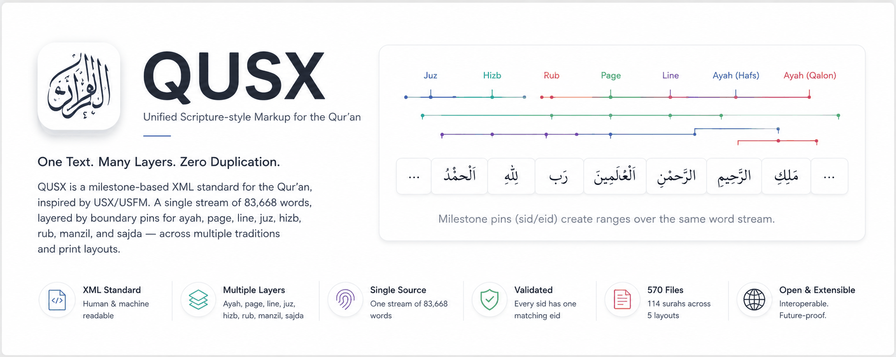
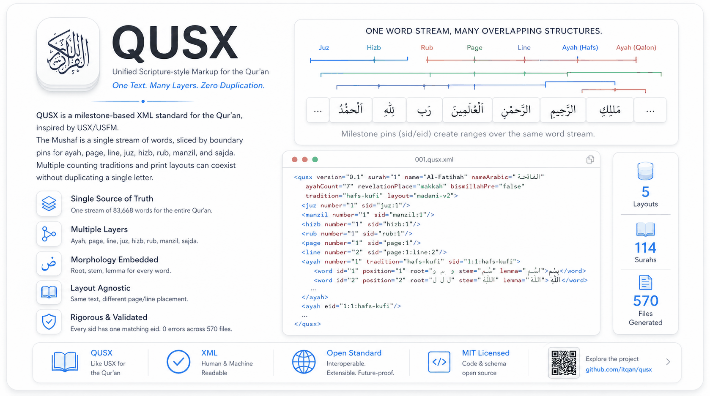

<p align="center">
  
</p>

<p align="center">
  <a href="https://github.com/dfordev1/usxv2/blob/main/LICENSE"></a>
  <a href="https://nodejs.org">=22" src="https://img.shields.io/badge/node-%3E%3D22-33564F.svg"></a>
  
  
  <a href="https://community.itqan.dev/d/549/2"></a>
</p>

# QUSX — a milestone-based XML standard for the Qur'an

**QUSX (Qur'an Unified Scripture XML)** is a data standard for representing Qur'anic
text, modeled directly on the Bible's **USX/USFM** milestone-markup convention (see
[`docs/prior-art-references.md`](docs/prior-art-references.md)). Instead of nesting
Qur'anic text inside a rigid surah → ayah → word tree, the Mushaf is treated as **one
flat stream of words**, sliced by independent boundary pins (`sid`/`eid`) for every
structural layer a Quran app actually needs: ayah, page, line, juz, hizb, rub, manzil,
sajda. Multiple qira'at/riwayat numbering traditions and multiple print-edition
layouts can coexist over that *same* text stream — without duplicating a single
letter.

Born out of a discussion on the [Itqan community](https://community.itqan.dev)
(threads [`/d/549`](https://community.itqan.dev/d/549), [`/d/501`](https://community.itqan.dev/d/501), [`/d/246`](https://community.itqan.dev/d/246))
about the lack of a unified Quranic data standard, and how the Bible's Digital Bible
Library / USX ecosystem solved the same problem — Scripture text served consistently
across 1,773 languages — for Bible software.

## Table of contents

- [Why this exists](#why-this-exists)
- [Status](#status)
- [Quick start](#quick-start)
- [Example output](#example-output-al-fatihah-abridged)
- [Tag reference](#tag-reference)
- [Data sources](#data-sources)
- [Validating and viewing](#validating-and-viewing)
- [Known gaps](#known-gaps)
- [Project layout](#project-layout)

## Why this exists

<p align="center">
  
</p>

Building a Qur'an app or API today usually means maintaining several *separate*,
easy-to-desync datasets: one for page-accurate rendering (matching a specific printed
Mushaf), one for searchable/structured text, one for word-level morphology, and — for
apps supporting more than one riwayah — a full duplicate text per riwayah. Every
independent Quranic-data project we surveyed (QUL, quran-svg, quranhub,
open-quran-view) reinvents a similar-but-incompatible page/line/word schema to solve
this same problem.

QUSX's flat word-stream + independent milestone pins means **one *per-surah* file
serves every view**: an app walks `sid`/`eid` pairs to reconstruct whichever slice it
needs within that surah — an ayah, a printed page, a juz fragment, a riwayah's
numbering — without re-fetching or duplicating the underlying text *within that
file*. To be precise about current scope: this project ships **1140 files** (114
surahs × 10 layouts), and text/morphology *is* duplicated once per layout — a page-2
KFGQPC-V2 file and a page-2 IndoPak file both carry the full word text independently,
because layout is baked into each generated document rather than factored into a
separate referenceable layer. Whether/how to split text, morphology, and layout into
independently-combinable documents (so a layout change wouldn't require
regenerating the underlying text) is unresolved — see [Known gaps](#known-gaps).

## Status

Generator produces output for **all 114 surahs, across 10 print layouts** (1140 files
total), checked against real data:

| Layout | Pages | Ayah pins | Word tokens | Sajda pins |
|---|---|---|---|---|
| KFGQPC V2 (1421H, default) | 604 | 6236 | 83668 | 15 |
| KFGQPC V1 (1405H) | 604 | 6236 | 83668 | 15 |
| QPC V4 Tajweed (1441H) | 604 | 6236 | 83668 | 15 |
| Mushaf Qatar | 604 | 6236 | 83668 | 15 |
| IndoPak 15-line (Qudratullah) | **610** | 6236 | 83668 | 15 |
| IndoPak 9-line (Gaba) | **1890** | 6236 | 83668 | 15 |
| IndoPak 13-line (Qudratullah) | **849** | 6236 | 83668 | 15 |
| IndoPak 13-line (Taj Company) | **847** | 6236 | 83668 | 15 |
| IndoPak 16-line (Taj Company) | **548** | 6236 | 83668 | 15 |
| KFGQPC Nastaleeq 15-line | 610 | 6236 | 83668 | 15 |

Text/ayah/word/sajda counts are identical across layouts (same underlying Hafs/Kufi
text) — only page/line placement changes per print edition, and each IndoPak/Nastaleeq
line-count variant correctly comes out to its own real-world page count instead of 604.

Two independent checks, not one: `src/validate.js` checks semantic invariants (every
`sid` has exactly one matching `eid`, no axis opened twice without closing, ayah
numbers run 1..N with no gaps) — **all 1140 files pass, 0 errors.** Separately,
`scripts/xsd_validate.py` runs the actual [`schema/qusx.xsd`](schema/qusx.xsd)
through a real XML Schema processor (`lxml`/libxml2) — **all 1140 files are also
XSD-valid.** These are deliberately two different tools checking different things
(structural shape vs. semantic pairing rules XSD 1.0 can't express); see
[Validating and viewing](#validating-and-viewing) for why both are needed.
[`viewer/viewer.html`](viewer/viewer.html) parses the generator's raw output with the
browser's own `DOMParser` and renders it, so the format is proven consumable
end-to-end, not just internally consistent.

The main generator (`src/generate.js`) ships **one tradition (Hafs/Kufi)** with real
word-level text, morphology (root/stem/lemma), and full page/juz/hizb/rub/manzil/ruku
milestone pins across all 10 print layouts (1140 files, all validated).

A **separate pilot generator** (`scripts/generate_tradition_pilot.js`) produces real,
XSD-valid ayah-numbering pins with real Arabic text for 4 more traditions — Warsh,
Qalun, Al-Duri, Shu'bah (456 files, `output-pilot/`) — plus Al-Susi as an
unscoped bonus. This is genuinely real, not a demo: real per-tradition text,
verified to differ from Hafs at the rasm level, not a relabeled copy. It is
**deliberately narrower** than the main generator's output, though — no
morphology, and no page/juz/hizb/rub/manzil/ruku pins, since those would need
re-deriving against each tradition's own numbering, not yet done. It's also kept
as a separate script rather than merged into `src/generate.js`, since that
generator is tightly coupled to Hafs-canonical indexing throughout. See
[Known gaps](#known-gaps) for open questions (license status of the pilot's
text source, an unresolved Al-Duri count discrepancy, and whether QUSX should
model numbering-only or full rasm/text variants).

## Quick start

```bash
node src/generate.js 1                        # generate one surah, default layout (KFGQPC V2) -> output/madani-v2/001.qusx.xml
node src/generate.js --layout=indopak-15 all  # generate the whole Qur'an in a different layout
node src/generate.js all                      # generate the whole Qur'an, default layout
```

Available `--layout` keys: `madani-v2` (default), `madani-v1`, `madani-v4-tajweed`,
`qatar`, `indopak-15`, `indopak-9-gaba`, `indopak-13-qudratullah`, `indopak-13-taj`,
`indopak-16-taj`, `nastaleeq`.

Requires Node 22+ (uses the built-in `node:sqlite` module).

## Example output (Al-Fatihah, abridged)

```xml
<qusx version="0.1" surah="1" name="Al-Fatihah" nameArabic="الفاتحة" ayahCount="7"
      revelationPlace="makkah" bismillahPre="false" tradition="hafs-kufi">
  <juz number="1" sid="juz:1"/>
  <manzil number="1" sid="manzil:1"/>
  <hizb number="1" sid="hizb:1"/>
  <rub number="1" sid="rub:1"/>
  <page number="1" sid="page:1"/>
  <line number="2" sid="page:1:line:2"/>
  <ayah number="1" tradition="hafs-kufi" sid="1:1:hafs-kufi"/>
  <word id="1" position="1" root="س   م   و" stem="سْمِ" lemma="اسْم">بِسْمِ</word>
  <word id="2" position="2" root="ا ل ه" stem="اللَّهِ" lemma="اللَّه">ٱللَّهِ</word>
  ...
  <ayah eid="1:1:hafs-kufi"/>
  ...
</qusx>
```

An app reassembles any ayah, page, juz, or word-with-morphology by walking between
matching `sid`/`eid` pairs over the same underlying word stream — no duplicated text
for different layouts or traditions.

## Tag reference

| Tag | Role | Notes |
|---|---|---|
| `<qusx>` | Root, one per surah | `tradition` = active ayah-counting scheme; `normalization="NFC"` states the text-encoding policy (checked by `validate.js`); `generatorVersion` self-declares what produced the file; `bismillahPre` — see note below |
| `<word>` | Base text unit (leaf) | `id` = global mushaf position, `position` = index within ayah, `type="number"` marks the ayah-ending verse-number glyph (not a lexical word — see below), `root`/`stem`/`lemma` = morphology embeds |
| `<ayah>` | Milestone pin | `tradition` attr allows multiple counting schemes over the same word stream |
| `<page>` / `<line>` | Milestone pin | From a specific print edition's layout — see `<qusx layout="...">` on the root element |
| `<juz>` / `<hizb>` / `<rub>` / `<manzil>` / `<ruku>` | Milestone pin | Standard 30/60/240/7-way divisions, plus thematic ruku markers (558 total); `fragment` (`whole`/`start`/`middle`/`end`) states whether this file's copy is the entire range or a piece of one spanning surahs — see below. Definitions in [`docs/quranic-structural-glossary.xlsx`](docs/quranic-structural-glossary.xlsx) |
| `<sajda>` | Point marker (non-paired) | Fires once at the ayah containing a prostration point; `type` = `required`/`optional`. **Precision limit, verified not fixable with current data:** QUL's sajda dataset only gives `verse_key` (ayah-level), not a word position — checked directly against `data/raw/quran-metadata-sajda.json`, which has no word field at all. The pin fires after the ayah's last word as the closest available approximation; pinning to the exact word would need a different/richer data source. |

**What `bismillahPre` means — verified, not assumed:** it's a **display-only flag**,
not a pointer to any `<word>` elements. Checked directly against real data: Surah
2's ayah 1 is just `الٓمٓ` (Alif-Lam-Meem) — no Basmalah words appear in the word
stream at all, even though `bismillahPre="true"`. This matches standard practice:
the opening formula printed atop most surahs is paratextual (a page heading, like
a surah's name), not part of the counted ayah text — except in Al-Fatihah, where
it genuinely *is* ayah 1 (and `bismillahPre="false"` there for exactly that
reason — it's already inside the ayah stream, not a separate heading), and
At-Tawbah, which has no Basmalah at all. A consumer wanting to *display* the
Basmalah before a surah needs to render it as static boilerplate text of their
own — QUSX doesn't carry it as data, and doing so would either duplicate the
Fatiha's actual ayah-1 text under a different guise or invent word elements with
no source-data backing.

Boundary tags follow the USX convention: `sid` opens a range, a matching bare `eid`
closes it. Each axis (juz/manzil/hizb/rub/page/line/ayah) is independently
well-paired — but axes are **not** required to nest inside one another in document
order. `page`/`line` are word-position-based and legitimately cross `ayah` (and
sometimes `juz`/`hizb`/`rub`) boundaries mid-ayah — e.g. Sūrat An-Nās ayah 3 is split
across two lines in the KFGQPC V2 layout. That crossing is exactly the "overlapping
structures" problem milestone markup exists to solve; see it live in
`viewer/viewer.html`.

**Cross-file fragment identity:** each `.qusx.xml` file covers one surah, so a
`juz`/`hizb`/`rub`/`manzil`/`ruku` that spans two surahs (e.g. Juz 1 covers all of
Surah 1 and part of Surah 2) is written once per file it touches — `sid="juz:1"`
opens and closes in `001.qusx.xml`, then opens and closes *again* in `002.qusx.xml`.
The `fragment` attribute on the opening pin disambiguates these explicitly:
`001.qusx.xml`'s `juz:1` carries `fragment="start"` (the range begins here), and
`002.qusx.xml`'s carries `fragment="end"` (continuation, ends here) — so a consumer
concatenating files can tell these are two pieces of *one* range, not two
coincidentally-numbered ones. A range entirely inside one surah (never crossing a
file boundary) gets `fragment="whole"`.

**What `tradition="hafs-kufi"` actually means:** the code is a deliberate compound,
not one flat label — `hafs` names the **recitation transmission** (riwāyah, i.e.
whose reading of Nafiʿ/ʿĀṣim/etc. this is) and `kufi` names the **ayah-counting
system** (ʿadd al-āy school) applied to it. These are two genuinely independent
axes — e.g. Warsh's transmission can in principle be counted by more than one
school — and the schema's closed `traditionCode` enum (see `schema/qusx.xsd`)
currently only has compound values for the specific transmission+counting pairs
this project has real per-surah data for (see `data/diff-report.json`), not a
general cross-product of every possible pairing.

## Data sources

All raw data lives in `data/` and was pulled from:

- **[QUL](https://qul.tarteel.ai)** (TarteelAI) — Uthmani word-by-word text, ayah/juz/hizb/rub/ruku/manzil/sajda metadata, word root/stem/lemma (`data/raw/`), and 5 Mushaf layouts — KFGQPC V1/V2/V4-tajweed, Mushaf Qatar, IndoPak 15-line (`data/layouts/`).
- **[quranpedia/quran-svg](https://github.com/quranpedia/quran-svg)** — per-surah ayah counts across 6 mushaf editions/5 qira'at, used to derive multi-tradition boundary deltas. Our derived analysis is in `data/diff-report.json`; the source repo's raw files are *not* bundled here since it currently has no published license — see it directly if you need the underlying polygon/page data.

Full citation list and independent prior-art (open-quran-view, DigitalKhatt) in
[`docs/prior-art-references.md`](docs/prior-art-references.md). A standalone
reference workbook of every structural term (juz, hizb, rub, manzil, ruku, sajda,
surah), built from the same real QUL data, is in
[`docs/quranic-structural-glossary.xlsx`](docs/quranic-structural-glossary.xlsx).
Exact per-file license/provenance terms for everything bundled are in
[`THIRD_PARTY_NOTICES.md`](THIRD_PARTY_NOTICES.md).

## Validating and viewing

```bash
npm run verify                                  # everything below, in one command (also runs in CI on every push)
node src/validate.js all                        # conformance-check every generated file, all layouts (semantic invariants: sid/eid pairing, ayah sequencing, word-position continuity, corpus-wide totals)
python scripts/xsd_validate.py                  # validate against schema/qusx.xsd with a real XML Schema processor (lxml/libxml2)
node test/run_tests.js                          # negative tests: proves both validators above actually reject bad input, not just pass good input
```

CI (`.github/workflows/ci.yml`) runs all three on every push/PR.

`src/validate.js` is a hand-written semantic checker (sid/eid pairing, ayah
sequencing, required attributes by convention) — it is **not** an XSD validator and
was never a substitute for one. `scripts/xsd_validate.py` runs the actual
`schema/qusx.xsd` through `lxml` and confirms **1140/1140 generated files are valid**
against it. Note XSD 1.0 cannot express "sid XOR eid" as a structural constraint
(see the comment in `qusx.xsd`), so that specific rule is still enforced only by
`validate.js`, not by the schema itself — this is a real, stated scope split
between the two tools, not an oversight.

Open `viewer/viewer.html` directly in a browser to see two real generated files
(Al-Fātiḥah and An-Nās) parsed live and rendered, with a raw-XML toggle and
click-to-inspect on every word.

## Text integrity

```bash
node src/checksum-verify.js   # compare QUL's Uthmani text against an independent SHA-256 manifest
```

This cross-checks our word data against the verse-level manifest from
[spqrxi/quranchecksum](https://github.com/spqrxi/quranchecksum), an independent
MIT-licensed tool built from Tanzil's KFGQPC-verified Uthmani text.

**Result: 1,125 / 6,236 verses (18%) match byte-for-byte. Applying three confirmed
normalization rules (never overriding a verse that already matched raw — see
`scripts/derive_standardized_plain_text.js`) explains more:**

| Cause | Explains (cumulative, cascading) | Verified how |
|---|---|---|
| Raw text (no transform needed) | 1,125 | baseline |
| + Tatweel-spaced superscript alef (`ـٰ`, U+0640 U+0670) — QPC glyph-font convention | +740 | diffed against a real Tanzil download |
| + Tanzil's download format prepends the Bismillah to a surah's first ayah (except Al-Fatihah, At-Tawbah) | +63 | hashed Al-Baqarah 2:1 both ways |
| + Quranic annotation/pause signs (waqf marks etc., U+06D6–U+06ED) present in QUL, absent from Tanzil's plain text | +567 net | diffed Al-Baqarah 2:2; found unsafe to apply blindly — 350 verses actually need these marks *kept*, so the rule only applies when it doesn't break an already-correct match |
| + Whitespace-collapse bugfix (stripping an annotation mark surrounded by spaces left a double space, which the annotation rule above never collapsed) | +701 | diffed the annotation rule's own output against a fresh Tanzil download, 2026-07-13 |
| **Total explained** | **3,196 / 6,236** | |
| **Still genuinely unexplained** | **3,040** | |

**Correction, 2026-07-13:** this table previously claimed 3,581 verses were explained by
the tatweel pattern and 989 more by a "wasla-alef codepoint choice" pattern, leaving only
541 unexplained. Those numbers were wrong, caught by actually turning the claimed rules
into code and re-testing against the real manifest instead of trusting the old prose:
- The tatweel rule is real, but only resolves 740 verses when actually applied and
  re-hashed — not 3,581. The old number likely counted verses merely *containing* the
  pattern, not verses that fully match once *only* that pattern is fixed (a verse can
  have this pattern and still diverge from Tanzil for an unrelated reason).
- The wasla-alef rule was flatly wrong. Checked directly against a real Tanzil download:
  Tanzil's own text uses the same wasla-alef codepoint (U+0671) in plenty of places (e.g.
  Al-Fatihah 1:6) — Tanzil does not consistently prefer plain alef. Applying this rule
  actively made the match count *worse* (1,125 → 515) before it was caught and removed.
- Two genuinely new patterns were found while investigating further: the Bismillah-
  prepending convention (above), and Quranic annotation signs QUL includes that Tanzil's
  plain download drops — the second one is real but was initially applied too broadly
  (regressed 350 previously-correct verses before that was caught and fixed to cascade
  per-verse instead of transforming unconditionally).

**Second pass, 2026-07-13 (same day, later):** re-diffed the still-unexplained list
directly against a fresh Tanzil download (not just the manifest hash — the actual text)
and found the annotation rule had a real bug: stripping a mark like `word ۖ word` left
`word  word` (double space), which never matches Tanzil's single-spaced text even though
the annotation itself was correctly removed. Fixing the whitespace collapse resolved 701
more verses for free, with no regression risk (it only changes candidates that didn't
already match). Also found, but explicitly did NOT auto-fix: ~2,038 of the remaining
unexplained verses are missing **U+06DF (Arabic small high rounded zero)**, a mark Tanzil
places after a silent word-final `وا` (e.g. verb plurals) that QUL's word data simply
doesn't encode at that position. This is a real, structural gap — QUL's text is missing a
recitation mark, not differently-encoding one Tanzil also has — but *which* `وا` occurrences
take the mark is a matter of Arabic morphology (verb conjugation), not a codepoint
substitution; guessing wrong would insert a linguistically incorrect mark into scripture
text. Left unresolved rather than guessed at.

The exit code from `checksum-verify.js` is **failure** when any mismatch exists, and
that's correct behavior — a partial explanation is not the same as a pass. **This
checksum result establishes that QUL's text is internally reproducible and
self-consistent — it does not establish byte-for-byte equivalence with Tanzil or any
other independent canonical source**, and the 3,040 unexplained verses (49% of all verses)
mean this project understands its divergence from that source far less
than earlier documentation claimed.

## Known gaps

1. **Multi-tradition pins exist as a real pilot, not in the main generator.**
   Real per-tradition Arabic text was found for Warsh, Qalun, Al-Duri, Shu'bah
   (and Al-Susi as a bonus) — sourced from `thetruetruth/quran-data-kfgqpc`, a
   third-party mirror of King Fahd Complex's official font/data packages —
   and used to generate real, XSD-valid ayah-numbering pins for all 114 surahs
   in each tradition (`scripts/generate_tradition_pilot.js`, output in
   `output-pilot/`). This is genuinely real, verified data (spot-checked to
   differ from Hafs at the rasm level, not a relabeled copy), not a mockup.
   Three real caveats, stated plainly rather than glossed over:
   - **License status is a judgment call, not a confirmed clearance.** The
     source repo has no LICENSE file or stated terms beyond "for developer"
     use. Included on the project owner's reasoning that King Fahd Complex's
     already-confirmed-permissive terms (via `quran-svg`'s licensing) likely
     extend to this derived text — see `THIRD_PARTY_NOTICES.md` for the full
     caveat. Treat as unverified-but-included, not cleared.
   - **Numbering/text only, not full parity with the main generator's output**
     — no morphology (root/stem/lemma), and no page/juz/hizb/rub/manzil/ruku
     pins, since those would need re-deriving against each tradition's own
     numbering, not yet done.
   - **Al-Duri has an unresolved 3-way count discrepancy** (6205 in the
     original Itqan announcement, 6218 from `quran-svg`, 6217 from this text
     source) — precisely located to surah 67 (30 vs 31 ayahs). Narrowed, not
     resolved: this is a real, documented classical ʿadd-al-āy
     (verse-counting) disagreement — Al-Mulk has 30 ayahs under the
     majority/Kufi counting school and 31 under the Ḥijāzī school, not a
     data-quality bug. Al-Duri and Al-Susi are both transmitters of Abu ʿAmr
     al-Basri, so the true count should follow the classical Basri counting
     school specifically — that number lives in specialized ʿulūm al-Qurʾān
     references (e.g. al-Dani's *al-Bayan fi ʿAdd Ay al-Qur'an*), not
     reachable from general web search.
   **Decided, not left open:** QUSX v1 models ayah **numbering only**, not
   rasm/text variants (Warsh's actual differing wording, not just verse
   boundaries) — that's a materially harder, separate problem, out of scope
   until there's a real plan for it. Al-Susi stays out of the formally-
   supported tradition list (not added to `schema/qusx.xsd`'s enum) since it
   has no independently verified ayah-count data and was never part of the
   originally-licensed 5-tradition scope — its pilot output remains a bonus
   artifact in `output-pilot/sousi/`.
   **Checked and ruled out** as a text source: [tanzil.net/download](https://tanzil.net/download/)
   — verified directly, no riwayah/qira'a selector at all.
2. **10 of QUL's 12 print layouts are wired in** (KFGQPC V1/V2/V4-tajweed,
   Mushaf Qatar, 5 IndoPak line-counts, KFGQPC Nastaleeq). The remaining 2
   (Digital Khatt, the SVG-based Ligature Basd Mushaf) are NOT wired in yet,
   but **not because of a data-shape mismatch** — that was a prior
   assumption, never actually checked. Corrected 2026-07-13: read QUL's own
   published schema docs for both directly, and both use the *exact same*
   `page_number`/`line_number`/`line_type`/`first_word_id`/`last_word_id`
   schema as the other 10 layouts already integrated. The real blocker is
   just downloading the actual SQLite files, which needs an authenticated
   QUL session — not yet done, but should follow the same pattern as the
   other 10 layouts once downloaded.
3. **Text/morphology are duplicated once per layout**, not factored into a
   separately-referenceable layer — see the [Why this exists](#why-this-exists)
   caveat. This is the one substantial item left that's a real architecture
   decision, not a mechanical fix: separating text/morphology/layout into
   independently-combinable documents needs a join-key contract designed first.
4. **3,040 of the 6,236 verses (see [Text integrity](#text-integrity))
   are genuinely unexplained against Tanzil** — 49% of all verses. An earlier
   version of this README claimed only 541 were unexplained; that number was
   wrong (see the 2026-07-13 corrections in that section). Four confirmed
   patterns now explain 3,196/6,236 verses total: tatweel-spaced encoding,
   Tanzil's Bismillah-prepending download convention, Quranic annotation signs
   QUL includes that Tanzil's plain text drops (only applied where it doesn't
   break an already-correct match), and a whitespace-collapse bugfix in that
   annotation rule. Of the remainder, ~2,038 verses are missing Tanzil's
   U+06DF (small high rounded zero) mark on silent word-final `وا` — a real
   gap in QUL's source data, not a normalization difference, and not safe to
   auto-fix (see the "second pass" correction note for why).
5. **Only ~26 of the ~150+ items from the fuller third-party review have been
   triaged and fixed** — the rest (richer schema semantics beyond what's listed
   below, release/versioning policy beyond `CHANGELOG.md`, punctuation/pause-sign
   modeling, extension/namespace policy, etc.) remain open.
6. **Sajda can't be pinned to an exact word with current data** — checked
   directly: `data/raw/quran-metadata-sajda.json` only has `verse_key`
   (ayah-level), no word position. This isn't a bug to fix in our code; it's a
   real limit of the source dataset. The pin fires at the end of the containing
   ayah as the closest available approximation.

**Closed since the audit:** real XSD compilation + validation (was previously only
regex-checked), CI (`.github/workflows/ci.yml`, including a deterministic-regeneration
check — committed output must exactly match a fresh build from source, verified with
two independent generation runs diffing byte-identical), 16 negative tests proving
the validators, CLI, cross-layout consistency check, and checksum script all
actually reject/catch bad input and match known-real baselines — not just pass good
input (`test/`), word-position and
corpus-completeness checks in `validate.js` (now including ruku totals and
per-layout page counts), filename/surah-name/count/place cross-checks against
canonical data, a cross-layout consistency check confirming word text and
morphology are byte-identical across all 10 layouts (only page/line placement
differs, as intended), a closed `tradition` enum and `surah`/`ayahCount` range
constraints in the schema, `<ruku>` pins (data was downloaded early on but sat
unused), `generatorVersion` and `normalization="NFC"` embedded in generated files
(with `validate.js` checking the latter is actually true), a `fragment` attribute
resolving the juz/hizb/rub/manzil/ruku cross-file identity ambiguity, a
`type="number"` distinction so verse-number glyphs aren't mistaken for lexical
words, CLI hardening (invalid/out-of-range surah args rejected; duplicate
args deduplicated, not rejected — `node src/generate.js 1 1` exits 0 and
writes surah 1 once; atomic temp-file-then-rename writes; duplicate
morphology mappings now warned about instead of silently overwritten),
`THIRD_PARTY_NOTICES.md`, `CONTRIBUTING.md`, and `CHANGELOG.md`.

This is a v0.1 research prototype open for review and contribution, not a
finished or formally released standard — see the
[Itqan community thread](https://community.itqan.dev/d/549/2) for ongoing
discussion. A structured third-party review surfaced ~160 gaps across schema
rigor, validator coverage, data-model layering, and release engineering; the
items above are the ones triaged and either fixed or explicitly tracked so far,
not an exhaustive list.

## Project layout

```
qusx/
├── .github/workflows/ci.yml   # runs validate.js + xsd_validate.py + test/ on every push
├── src/
│   ├── generate.js           # the generator
│   ├── validate.js           # semantic conformance checker (not an XSD validator)
│   └── checksum-verify.js    # cross-checks text against an independent SHA-256 manifest
├── scripts/
│   ├── xsd_validate.py       # real XSD validation via lxml (requirements.txt)
│   └── build_glossary_xlsx.py
├── test/
│   ├── run_tests.js          # negative tests: proves validators actually reject bad input
│   └── fixtures/             # deliberately malformed/invalid .qusx.xml files
├── schema/qusx.xsd            # formal element/attribute shape
├── viewer/viewer.html         # live DOMParser-based viewer (self-contained)
├── data/
│   ├── raw/                  # QUL exports (text, metadata, morphology, default layout)
│   ├── layouts/               # 4 additional QUL Mushaf layout databases
│   ├── external/              # third-party manifests (quranchecksum)
│   └── diff-report.json      # our derived per-surah ayah-count deltas across traditions
├── output/<layout-key>/      # generated *.qusx.xml, one per surah per layout
├── assets/                   # banner and diagram images
├── LICENSE                   # MIT (code/schema only — see note on bundled data)
├── THIRD_PARTY_NOTICES.md     # exact provenance/terms for every bundled dataset
├── CONTRIBUTING.md
├── CHANGELOG.md
├── requirements.txt           # Python deps for scripts/
├── package.json
└── docs/
    ├── prior-art-references.md
    └── quranic-structural-glossary.xlsx
```
